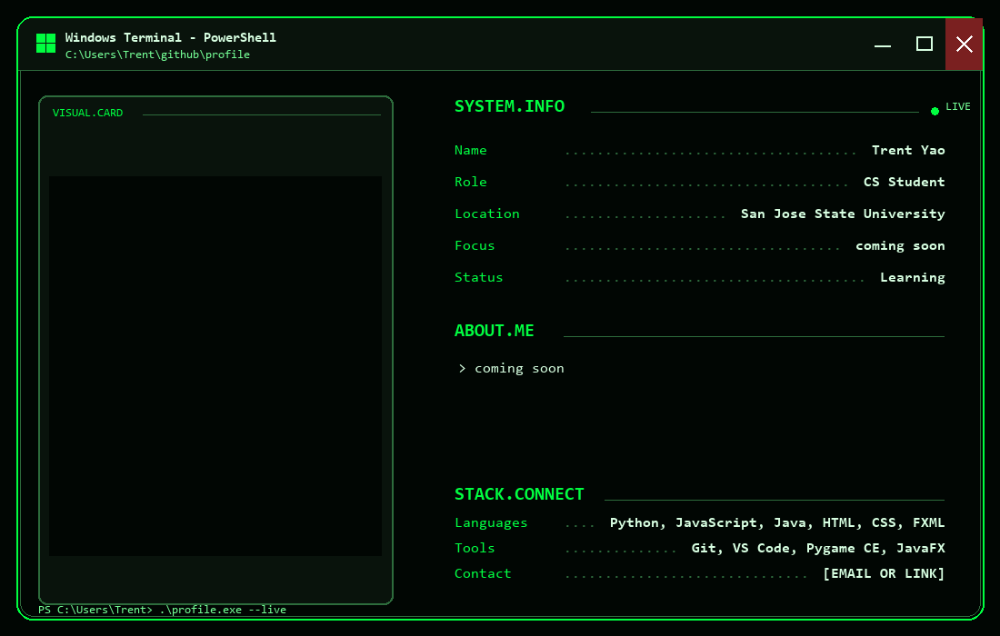

<!--
WINDOWS MATRIX PROFILE WITH GIF INSIDE THE SAME TERMINAL WINDOW

1. Put your original GIF at: assets/card-animation.gif
2. Edit your profile values near the top of build_terminal_gif.py
3. Run: py build_terminal_gif.py
4. Commit README.md and assets/windows-matrix-profile.gif
-->

  

## Projects

<!-- Replace these with your projects. -->
<table>
  <tr>
    <td width="50%" valign="top">
      <h3>Project One</h3>
      
Add a short description here.

      
<a href="YOUR_PROJECT_LINK">View project →</a>

    </td>
    <td width="50%" valign="top">
      <h3>Project Two</h3>
      
Add a short description here.

      
<a href="YOUR_PROJECT_LINK">View project →</a>

    </td>
  </tr>
</table>

## Connect

  
  
  

